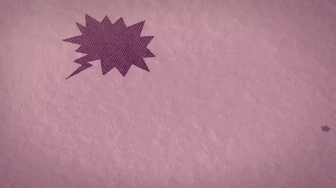

  

  </video>

#

<h3>⚡ Sobre mim:</h3>

Atualmente no 4º semestre de Ciência da Computação, sou movida pela curiosidade de entender o "porquê" por trás das tecnologias. Mais do que apenas escrever linhas de código, vejo no desenvolvimento de software a ferramenta ideal para transformar ideias e problemas complexos em soluções concretas e eficientes.

<h3>🚀 Meu Foco Atual:</h3>

• Construindo uma base sólida em <b>Desenvolvimento Web Full Stack</b> 

• Criação de projetos práticos para consolidar conhecimentos em <b>Web e novas tecnologias</b> 

<b>• Boas práticas</b> de código, testes de arquitetura e resolução eficiente de <b>problemas</b>

<h3>💡 Como eu aprendo e desenvolvo:</h3>

Não me contento em apenas "fazer o código rodar". Meu processo envolve colocar a mão na massa, testar arquiteturas, investigar erros e entender a lógica de cada ferramenta.

Neste GitHub, você encontrará a documentação prática da minha evolução: projetos estruturados, experimentos e soluções que demonstram minha capacidade de aprender e resolver problemas de forma autônoma.

 
<!--Line-->

  <h3> Contact & Socials 🌐 </h3>

  

    
    
    
  

  <h3>Languages & Tools 🛠️</h3>

  

    
  

#
<!-- Título Centralizado -->

  <h3>Experiência de trabalho</h3>

<!-- Conteúdo com Imagem e Texto Alinhados -->

  

  

    <b>Estagiário Voluntário</b> 
    <a href="https://www.qualivida.com.br/">Qualivida</a> • Voluntário 
    Linguagens & Tecnologias: <code>JavaScript</code>, <code>Node</code>, <code>HTML</code>, <code>CSS</code>, <code>Java</code>, <code>Excel</code> 
    Duração: 6 meses
 

#
 
 

<h3 align="center">GitHub Stats</h3>

  
  

<picture align="center">
  <source media="(prefers-color-scheme: dark)" srcset="https://raw.githubusercontent.com/suzanaisiss/suzanaisiss/output/github-contribution-grid-snake-dark.svg">
  <source media="(prefers-color-scheme: light)" srcset="https://raw.githubusercontent.com/suzanaisiss/suzanaisiss/output/github-contribution-grid-snake-dark.svg">
  
</picture>

  

    Last update: october/2026
  

